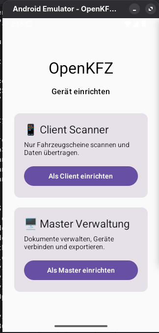

---

# Technologie

## Android

- Kotlin
- Jetpack Compose
- Android SDK
- Gradle

## Geplant

OCR:

- OpenCV
- Tesseract OCR
- weitere Open-Source OCR Lösungen

Daten:

- SQLite
- lokale Dateien
- strukturierte Fahrzeugdaten

Kommunikation:

- lokales WLAN
- Netzwerk-Synchronisation
- modulare Architektur

---

# Aktueller Entwicklungsstand

## Fertig ✅

- Android Projekt eingerichtet
- Kotlin eingerichtet
- Jetpack Compose UI
- Android Emulator eingerichtet
- APK Installation getestet
- Client/Master Konzept erstellt
- Erste Benutzeroberfläche umgesetzt

## Entwicklung 🚧

- Setup Bildschirm
- Client Scanner Oberfläche
- Master Verwaltungsoberfläche

## Geplant 📋

- Kamera Integration
- automatische Dokumentenerkennung
- OCR Engine
- PDF Generator
- lokale Datenbank
- Synchronisation im Netzwerk
- Export Funktionen

---

# Screenshots 📸

## Setup Bildschirm

Geräteauswahl zwischen Client und Master.

## Client Scanner

Einfache Scanner-Oberfläche für Mitarbeiter.

## Master Verwaltung

Verwaltung und Übersicht der gespeicherten Dokumente.

---

# Projektstruktur

