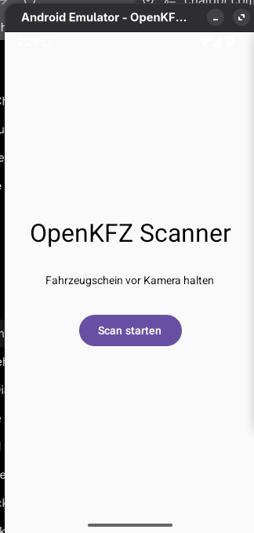
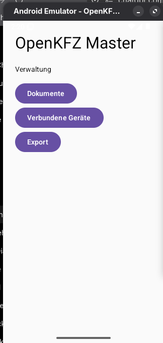

# OpenKFZ

Open-Source-Android-App zur lokalen Digitalisierung und Verwaltung von Fahrzeugpapieren in Unternehmen. Läuft vollständig lokal, ohne Cloud-Zwang. Näheres zur Vision und Architektur in [PROJECT_OVERVIEW.md](PROJECT_OVERVIEW.md).

Ein Gerät läuft als **Master** (Verwaltung, Datenbank, Dateien) und beliebig viele Geräte als **Client** (Kamera-Aufnahme), gekoppelt per QR-Code.

---

## Build & Ausführen

Voraussetzungen: JDK 17+, Android SDK (minSdk 28, targetSdk 36).

```
git clone https://github.com/NeoShinobiDev/OpenKFZ.git
cd OpenKFZ
./gradlew assembleDebug
```

Die fertige APK liegt danach unter `app/build/outputs/apk/debug/app-debug.apk`. Fertige Releases mit APK-Asset gibt es auch unter [Releases](https://github.com/NeoShinobiDev/OpenKFZ/releases).

Es gibt keinen Google-Play-Store-Eintrag – Installation aktuell nur manuell über die APK, eine Veröffentlichung über F-Droid ist eine Option für später.

---

# Technologie

## Android

- Kotlin
- Jetpack Compose
- Android SDK
- Gradle

## Geplant

OCR:

- OpenCV
- Tesseract OCR
- weitere Open-Source OCR Lösungen

Daten:

- SQLite
- lokale Dateien
- strukturierte Fahrzeugdaten

Kommunikation:

- lokales WLAN
- Netzwerk-Synchronisation
- modulare Architektur

---

# Aktueller Entwicklungsstand

## Fertig ✅

- Android Projekt eingerichtet
- Kotlin eingerichtet
- Jetpack Compose UI
- Android Emulator eingerichtet
- APK Installation getestet
- Client/Master Konzept erstellt
- Erste Benutzeroberfläche umgesetzt
- Kamera-Integration mit Foto-Vorschau (Übernehmen/Verwerfen) und Blitz-Umschalter
- Geräte-Kopplung per QR-Code
- Lokale Datenbank (Room) für Fahrzeugdaten
- Dateiverwaltung mit Vorschau und Löschbestätigung
- Backup, Export und Import als JSON
- Admin-Bereich mit Systemstatus und Gefahrenzone


## Geplant 📋

- automatische Dokumentenerkennung
- OCR Engine
- PDF Generator
- Synchronisation im Netzwerk

---

# Screenshots 📸

## Client Scanner

Einfache Scanner-Oberfläche für Mitarbeiter.




## Master Verwaltung

Verwaltung und Übersicht der gespeicherten Dokumente.



---

# Projektstruktur

```
com.openkfz
├── app             Einstiegspunkt, Master-UI (Dashboard, Geräte, Dateien,
│                   Datenbank, Admin, QR, Einstellungen), Room-Datenbank
├── client          Client-Rolle: Verbindung zum Master
├── ui              Kamera-Aktivität (Aufnahme, Vorschau, Blitz)
└── modules         Geteilte Fahrzeug-Logik
```

Bestehende Struktur und Package-Aufteilung bleiben bewusst so bestehen (siehe [AGENTS.md](AGENTS.md)) – keine Architekturänderung, keine Clean-Architecture-Migration.

